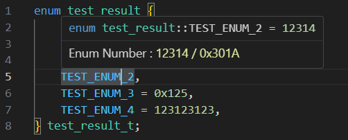
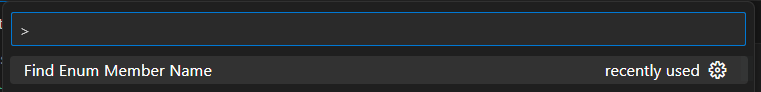

# Enum Counter for CPP

This extension simply parses the enum values in c++ headers file and show when the mouse hovers over the enum.

Due to not relying on intellisense, when opening large cpp files, it can show enum Value faster than intellisense.

[](https://github.com/stu92116/count_CPP_Enum/actions/workflows/main.yml)


## Features

Show the enum values even if the enum have been specified certain number.

As picture shown below, it will pop up a window showing the enum values.



#### Support custom specific config in Vscode Settings.
 + Color of Enum value showing on hover. Ex. `#ff00ff`
 + Different type base of number, such as Dec, Hex, Bin.

#### Support custom command below, which can find certain Enum Member in cursor scope of enum.

``` Find Enum Member Name ```




## Requirements

None.

## Extension Settings

None.

## Author

- Ian.Su

## Known Issues

Look at the Issue page for more information


## Release Notes

Release notes

### 0.0.1

[New] First release of this extension.

### 0.0.2

[New] Add Color for number
[Fix] Enum assign values from other Enum

### 0.0.5

[New] Add Icon

### 0.0.6

[New] Support for value assign with bit operation  

### 0.0.7

[Fix] Bug fixes for enum assignments comes with comments.  

### 0.0.8

[New] Support custom specific config in Vscode Settings.

 + Color of Enum value showing on hover. Ex. `#ff00ff`
 + Different type base of number, such as Dec, Hex, Bin.
  
[New]  Support custom command below, which can find certain Enum Member in cursor scope of enum.

### 0.0.9

[Fix] Bug fixes for last enum non-assign values parsing Error

---

**Enjoy!**
